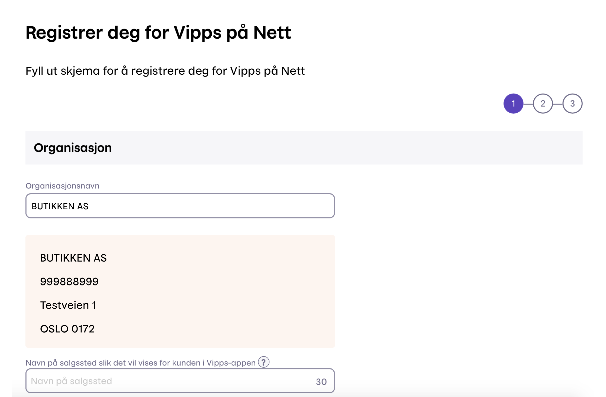

# Vipps Partner Signup API

**IMPORTANT:** This API is phased out. Do _*NOT*_ integrate with this API.
See
[the partner information](https://github.com/vippsas/vipps-partner)
for more, especially
[Vipps Partner API: How to sign up new merchants](https://github.com/vippsas/vipps-partner#how-to-sign-up-new-merchants).
Please contact your partner contact in Vipps for more information.

----

This repository contains developer resources for the Vipps Partner Signup API.

API Documentation: https://vippsas.github.io/vipps-signup-api/

Document version 3.1.0.

## Table of contents

* [About the Vipps Partner Signup API](#about-the-vipps-partner-signup-api)
* [Process overview](#process-overview)
  + [Flow diagram](#flow-diagram)
  + [API call details](#api-call-details)
* [Signup forms](#signup-forms)
  + [Signup form provided by the partner](#signup-form-provided-by-the-partner)
  + [Signup form provided by Vipps](#signup-form-provided-by-vipps)
* [Additional developer resources](#additional-developer-resources)
* [Questions?](#questions-)

## About the Vipps Partner Signup API

The Vipps Partner Signup API lets partners create pre-filled signup forms for Vipps
eCommerce for their merchants.

The partner calls the API to pre-fill the signup form with the merchant's data,
and automatically receive the merchant's details when the merchant has signed
the form with BankID.

It is a _very_ simple API. We are aware that there is a need for more functionality,
and we hope to extend the API. Subscribe to the
[Technical newsletter for developers](https://github.com/vippsas/vipps-developers/tree/master/newsletters)
for updates.

To become a partner and to get the `partnerId`, `subscriptionPackageId`, etc: See
[Become a partner](https://vipps.no/developer/bli-partner/).

To contact Vipps as a (potential) partner: See
[Contact information](https://github.com/vippsas/vipps-developers/blob/master/contact.md).

**Please note:** The Signup API has some dependencies that are not in place
in our test environment. Because of this we recommend to "test in prod" by
signing up yourself, with your own organization number: Verify that you are
able to "pre-fill" an application and get the URL for it, ready for completion
and signing. We recommend _not_ to complete the whole process by signing the
order with BankID, as you then "use up" your organization number, and also
initiate the whole process at Vipps.

## Process overview

### Flow diagram

Norwegian only, sorry.


### API call details

1. The partner sends the merchant details to Vipps with
   [`POST:/v1/partial/signup`](https://vippsas.github.io/vipps-signup-api/#/Signup/partialSignup)
   ```
   {
     "orgnumber": "996348954",
     "partnerId": "265536",
     "subscriptionPackageId": "2",
     "signupCallbackUrl": "https://www.example.com/vipps/callback",
     "signupCallbackToken": "c00be7de-64c4-11e8-adc0-fa7ae01bbebc",
     "merchantWebsiteUrl": "https://www.example.com/",
     "form-type": "vippspanett"
   }
   ```
2. The response for the above API call contains an URL:
   ```
   {
     "signup-id": "81b83246-5c19-7b94-875b-ea6d1114f099",
     "vippsURL": "https://vippsbedrift.no/signup/vippspanett/?r=81b83246-5c19-7b94-875b-ea6d1114f099"
   }   
   ```
3. The merchant must open the URL and sign the Vipps order with BankID.
   The signup link is valid for 30 days. After that it will show an error.
4. When the merchant has signed, the partner will receive a callback from
   Vipps with the merchant's details:
   [`POST:/signupcallbackURL`](https://vippsas.github.io/vipps-signup-api/#/Signup%20Callback/callback)
   ```
   {
     "signup-id": "81b83246-5c19-7b94-875b-ea6d1114f099",
     "orgnumber": "996348954",
     "merchant-name": "Merchant AS",
     "createdTime": "00:00:00",
     "merchantSerialNumber": "123456",
     "client_Id": "51358942-08c8-4d50-99f4-a9aa970b5f5b",
     "client_Secret": "verysecret123",
     "subscriptionKeys": [
       {
         "product": "Access",
         "ocp-apim-subscription-key": "de897dbb-0cd3-4445-b003-ac8214ac4638"
       },
       {
         "product": "Ecommerce",
         "ocp-apim-subscription-key": "de897dbb-0cd3-4445-b003-ac8214ac4638"
       }
     ]
   }   
   ```
   **Please note:** The two `ocp-apim-subscription-key` are identical, for
   backwards compatibility. See details/background in
   [Getting started](https://github.com/vippsas/vipps-developers/blob/master/vipps-getting-started.md#api-products).
5. The partner informs the merchant when everything is ready.

See the eCom API documentation for some tips on testing callbacks (it's a different API, but the overall concept is the same):
[How to test your own callbacks](https://github.com/vippsas/vipps-ecom-api/blob/master/vipps-ecom-api.md#how-to-test-your-own-callbacks).

## Signup forms

### Signup form provided by the partner

The partner can implement a signup registration form for merchants on the
partner's website. The merchant enters their organization number and the URL
for their website in the form. When they click register, the signup is initiated.


### Signup form provided by Vipps

The standard Vipps signup functionality on vipps.no can be used.
The merchant is then redirected to the signup link, and can complete the
registration form on vipps.no.



## Additional developer resources

See the the main developer page: https://github.com/vippsas/

## Questions?

We're always happy to help with code or other questions you might have!
Please create an [issue](https://github.com/vippsas/vipps-signup-api/issues),
a [pull request](https://github.com/vippsas/vipps-signup-api/pulls),
or [contact us](https://github.com/vippsas/vipps-developers/blob/master/contact.md).

Sign up for our [Technical newsletter for developers](https://github.com/vippsas/vipps-developers/tree/master/newsletters).
